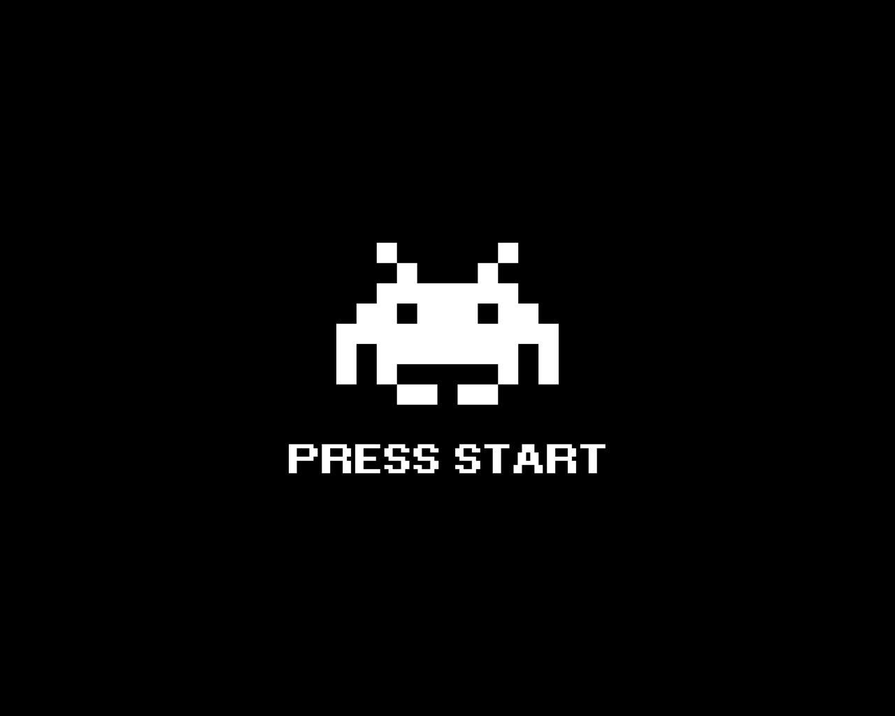

<div center="align">

# space evolution 



</div>

---

### Sommaire

- [Description](#description)
- [Installation](#installation)
- [Lancer le jeu](#lancer-le-jeu)
- [Créer un executable Windows](#cr%C3%A9er-un-executable-windows)
- [Créer un executable Linux](#cr%C3%A9er-un-executable-linux)

---

## Description

un space invaders like en python avec évolution des graphismes et du gameplay à chaques niveaux.

## Installation

Ce jeu utilise [Pygame](https://github.com/pygame/pygame), vous devez donc l'installer:

```bash
py -m pip install pygame
```

# Lancer le jeu

pour lancer le jeu:

```bash
cd ./src
py src/index.py
```

## Créer un executable Windows

Vous devez dans un premier temps installer la lib [pyinstaller](https://pyinstaller.readthedocs.io/en/stable/usage.html):

```bash
py -m pip install pyinstaller
```

> **Il est possible qu'il faille aussi instaler la lib `pywin32`**:
>
> ```bash
> py -m pip install pywin32
> ```

Ensuite, dans le repértoire racine du projet, tapez la commande suivante:

```bash
pyinstaller ./src/index.py -F -w
```

OU:

```bash
C://[chemin-vers-dossier-ou-python-est-installé]/Python38/Scripts/pyinstaller.exe ./src/index.py -F -w
```


L'executable est créé dans le dossier dist, il faudra copier le dossier `assets` dans le dossier `dist` car seuls les fichier `.py` sont compilé dans le `.exe`:

```bash
cp ./src/assets/ ./dist/
```

Vous pouvez ensuite renomer le dossier `dist` ainsi que l'executable:

```bash
mv ./dist/index.exe ./dist/space-evolution.exe
mv ./dist/ ./space-evolution_v-1-0-0_win
```

Vous pouvez ensuite distribuer le dossier `space-evolution_v-1-0-0_win`.


## Créer un executable Linux

Vous devez dans un premier temps installer la lib [cx_freeze](https://github.com/marcelotduarte/cx_Freeze):

```bash
py -m pip install cx_Freeze
```

Dans le repértoire racine du projet, tapez la commande suivante


```bash
py setup.py build
```

> TODO: La suite reste à ecrire... 